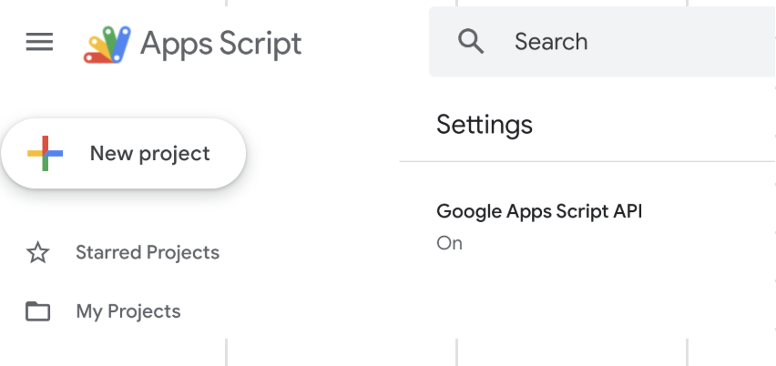

<!--
Copyright 2025 Google LLC

Licensed under the Apache License, Version 2.0 (the "License");
you may not use this file except in compliance with the License.
You may obtain a copy of the License at

      http://www.apache.org/licenses/LICENSE-2.0

Unless required by applicable law or agreed to in writing, software
distributed under the License is distributed on an "AS IS" BASIS,
WITHOUT WARRANTIES OR CONDITIONS OF ANY KIND, either express or implied.
See the License for the specific language governing permissions and
limitations under the License.
-->

# Giga: Gemini Insights Generation Analysis

## Overview

By applying Gemini's AI capabilities, GIGA can cluster and intelligently
interpret keyword data. This provides clients with actionable, strategic
insights for making marketing decisions.

*Please note: Search volume and other metrics are randomized for demonstration purposes.*

## Challenge Addressed

Clients want to stay ahead of current search/keyword trends and capitalize on them quickly. Up-to-date insights into search trends are crucial for optimizing ad campaigns and driving sales in key product categories.

## Outcome & Impact

A clustering of all keyword ideas related to the input topic keywords. Also the solution provides an insights summary page and a recommendation for campaigns to be created to capture the current trending topics.

This provides clients with actionable, strategic insights for making marketing decisions and help them create campaigns based on the insights.

Explore the search volume history of your seed keywords:
 

Analyze generated clusters to identify trending topics:
 

Inspect trending keywords:
 

## Services Used

This project utilizes the following Google services:

*   **[Vertex AI](https://cloud.google.com/vertex-ai/docs):** Used for generating intelligent insights and clustering keywords using Gemini models.
*   **[Google Ads API (Keyword Planner)](https://developers.google.com/google-ads/api/docs/keyword-planning/generate-keyword-ideas):** Used for fetching keyword ideas, search volumes, and historical metrics.

## Prerequisites

- Google Ads Account with a Developer Token (needs **"Basic"** or **"Standard"** access level)
- Google Cloud Project with Vertex AI enabled
- Google Workspace (to run Google Apps Script)

## Get Started

To get started with GIGA:

1. Make a copy of the Google AppsScript project
   <a href="https://script.google.com/corp/home/projects/1ISsbf-oDTHMzr-G6zIl3FmPz-ZkneTVQjfXehpG1mJLaFDTjyCvJprgA" target="_blank" rel="noopener noreferrer">template</a>
 

1. Navigate to [Apps Script Settings](https://script.google.com/corp/home/usersettings) and ensure that the Apps Script API is enabled
 

1. Link AppsScript to a Google Cloud Project. Therefore navigate to “Project Settings“ and add your project number (only numbers and not to be confused with the ID, full guide [here](https://developers.google.com/apps-script/guides/cloud-platform-projects)).
 

1. Deploy the solution as a Web-App
(see [this](https://developers.google.com/apps-script/guides/web#deploy_a_script_as_a_web_app) for details)
  
The user set in "Execute as" needs at least the Vertex AI User ([roles/aiplatform.user](https://docs.cloud.google.com/vertex-ai/docs/general/access-control#aiplatform.user)) IAM role as well as [read access](https://support.google.com/google-ads/answer/9978556) to the associated Google Ads Account.

1. Setup
 When you run the application the first time, it'll automatically show the settings screen where you need to specify your Google Ads account Id and the corresponding developer token.
  
Please note the following:
- The developer token needs **"Basic"** or **"Standard"** access level ("Test Account Access" is not sufficient, see [access levels](https://developers.google.com/google-ads/api/docs/access-levels) for details).
- A Google Cloud project can be associated with only one developer token (see [this](https://developers.google.com/google-ads/api/docs/get-started/common-errors) for details).

**Disclaimer: This is not an official Google product.**

