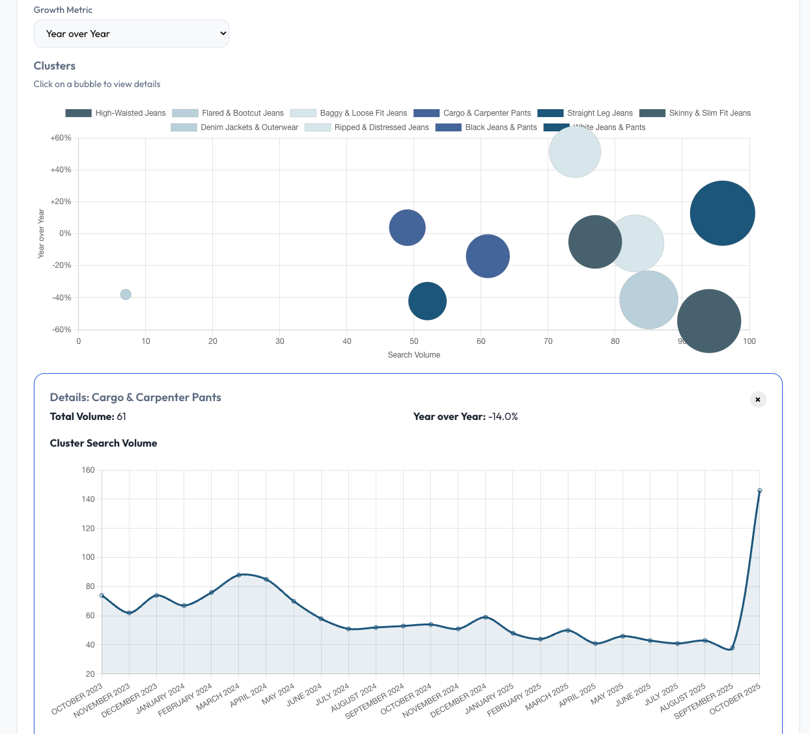
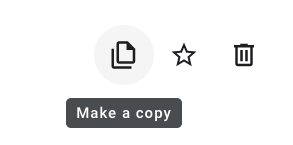
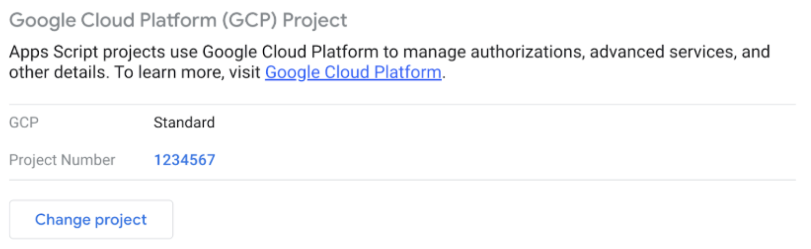

<!--
Copyright 2025 Google LLC

Licensed under the Apache License, Version 2.0 (the "License");
you may not use this file except in compliance with the License.
You may obtain a copy of the License at

      http://www.apache.org/licenses/LICENSE-2.0

Unless required by applicable law or agreed to in writing, software
distributed under the License is distributed on an "AS IS" BASIS,
WITHOUT WARRANTIES OR CONDITIONS OF ANY KIND, either express or implied.
See the License for the specific language governing permissions and
limitations under the License.
-->

# GIGA: Gemini Insights Generation Analysis

## Overview

By applying Gemini's AI capabilities, GIGA can cluster and intelligently
interpret keyword data. This provides clients with actionable, strategic
insights for making marketing decisions.

*Please note: Search volume and other metrics are randomized for demonstration purposes.*

## Challenge Addressed

Clients want to stay ahead of current search/keyword trends and capitalize on them quickly. Up-to-date insights into search trends are crucial for optimizing ad campaigns and driving sales in key product categories.

## Outcome & Impact

A clustering of all keyword ideas related to the input topic keywords. Also the solution provides an insights summary page and a recommendation for campaigns to be created to capture the current trending topics.

This provides clients with actionable, strategic insights for making marketing decisions and help them create campaigns based on the insights.

Explore the search volume history of your seed keywords:
 

Analyze generated clusters to identify trending topics:
 

Inspect trending keywords:
 

## Services Used

This project utilizes the following Google services:

*   **[Vertex AI](https://cloud.google.com/vertex-ai/docs):** Used for generating intelligent insights and clustering keywords using Gemini models.
*   **[Google Ads API (Keyword Planner)](https://developers.google.com/google-ads/api/docs/keyword-planning/generate-keyword-ideas):** Used for fetching keyword ideas, search volumes, and historical metrics.

## Limitations

*   **[Keyword Idea Service](https://developers.google.com/google-ads/api/docs/keyword-planning/generate-keyword-ideas):** This service provides data based on full months. Consequently, data for the current month is not yet available; it becomes accessible only after the month has concluded. Additionally, there is a ≈10 days delay (e.g. on 10th March, data for complete February will be available).
*   **[Keyword Volume](https://developers.google.com/google-ads/api/docs/keyword-planning/generate-keyword-ideas#historical_metrics):** Please note that keyword volume figures are rounded.

## Prerequisites

- **Google Ads Account with a Developer Token:** The developer token needs **"Basic"** or **"Standard"** access level ("Test Account Access" is not sufficient, see [access levels](https://developers.google.com/google-ads/api/docs/access-levels) for details). Additionally, it requires the **"Permissible Use"** for **"Researching keywords and recommendations"** (see [permissible use](https://developers.google.com/google-ads/api/docs/api-policy/access-levels#permissible-use) for details).
- Google Cloud Project with [Vertex AI](https://cloud.google.com/vertex-ai) enabled
- Google Workspace (to run [Google Apps Script](https://developers.google.com/apps-script))

## Get Started

To get started with GIGA:

1. Make a copy of the Google Apps Script project
   <a href="https://script.google.com/home/projects/1ISsbf-oDTHMzr-G6zIl3FmPz-ZkneTVQjfXehpG1mJLaFDTjyCvJprgA" target="_blank" rel="noopener noreferrer">template</a>
 

1. Link Apps Script to a Google Cloud Project. Therefore navigate to “Project Settings“ and add your project number (only numbers and not to be confused with the ID, full guide [here](https://developers.google.com/apps-script/guides/cloud-platform-projects)).
 

1. Deploy the solution as a Web-App
(see [this](https://developers.google.com/apps-script/guides/web#deploy_a_script_as_a_web_app) for details)
  
The user set in "Execute as" needs at least the Vertex AI User ([roles/aiplatform.user](https://docs.cloud.google.com/vertex-ai/docs/general/access-control#aiplatform.user)) IAM role as well as [read access](https://support.google.com/google-ads/answer/9978556) to the associated Google Ads Account.

1. Setup
 When you run the application the first time, it'll automatically show the settings screen where you need to specify your Google Ads account Id and the corresponding developer token.
  
Please note the following:
- A Google Cloud project can be associated with only one developer token (see [this](https://developers.google.com/google-ads/api/docs/get-started/common-errors) for details).

## Contribution (Deploying solution locally)
Since this is open source solution, it is also possible to make contribution by building additional features. To deploy the solution locally you can follow next steps:
1. Ideally, you should already have installed: `node.js`, `npm`, and `git`
2. Install [clasp](https://github.com/google/clasp). `clasp` allows you to develop your Apps Script projects locally. You will need this because Giga is developed in Apps Script
3. Clone this Github repository
4. Open the cloned repo in your code editor (e.g. VS Code)
5. In IDE, open Terminal and install [ASIDE](https://github.com/google/aside), by running this command: `npx @google/aside init`. During the installation, it will ask you couple of questions:
  * Project title - provide the name you want
  * Create Angular UI - select No
  * After that, it will ask 6-7 times to replace or overwrite certain file. On each question select No
  * Next, it will ask you for "Script ID (optional)" and "Script ID for production environment (optional)". On both question you don't have to provide anything, you can just press Enter and it will create the files automatically for you
  * After it finished the installation process, it should provide you the Google Sheets and AppsScript Link. Apps Script link is what you will need
6. Next, in your IDE in terminal, run `npm run deploy`. **NOTE:** In case if you get error "FAIL  test/example-module.test.ts", just delete "test" folder from project directory and run `npm run deploy` command again
7. After it finishes, go to the [Apps Script](https://script.google.com/) page and open the file with the project title you gave during the installation process
8. Once you opened the file, in upper right corner click on blue button "Deploy" -> "New deployment".
9. It will open popup. Click on gear icon next to the "Select type". Select "Web App". Add description if you want. And once you are ready, click on "Deploy" button.
10. It will ask you authorize the access and give the permissions. Once you provide it, you should see the screen where it says "Deployment successfully updated.". On this screen you will find *Web app URL*. Copy the URL, open in the browser and you should see your Giga app!

### Process of making changes and deploying it
In case if you make some changes in the code and you want to deploy and test them, follow these steps:
1. After you make changes, open terminal in your IDE and run `npm run deploy`
2. When process is finished, go to the [Apps Script](https://script.google.com/) page and open your project file. Click on button "Deploy" -> "New deployment" and then on "Deploy" button again
3. After you get message that deplyoment is successfully updated, copy the link that you see in popup and open it in the browser\

**Keep in mind**: After each deployment, Apps Script gives you new URL, so to see the latest version of Giga app, you need to use URL from the latest deployment. If you are not sure what is the URL, you can find it by clicking on button "Deploy" -> "Manager deployment" and here you will find list of versions you deployed over time.\
To test your web app, you can also use Apps Script [test deployments](https://developers.google.com/apps-script/guides/web#test_a_web_app_deployment). 

## Troubleshooting

If you encounter issues, please verify the following:
*   **[Developer Token Access](https://developers.google.com/google-ads/api/docs/access-levels):** Ensure your developer token has at least **"Basic"** or **"Standard"** access level. Test account access is insufficient.
*   **[GCP Project Binding](https://developers.google.com/google-ads/api/docs/get-started/common-errors):** Remember that a Google Cloud Project is permanently associated with the first developer token used. Ensure you haven't previously used a different token with this project.
*   **Connection Test:** To verify your access to Vertex AI and the Google Ads API, you can make a copy of this [Test Spreadsheet](https://docs.google.com/spreadsheets/d/1ZUR1XxyCA48YhULFYUBOb86CMcgavD6boO5kNtb-kXk/view) and run the included tests.

**Disclaimer: This is not an official Google product.**

