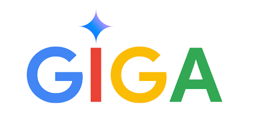
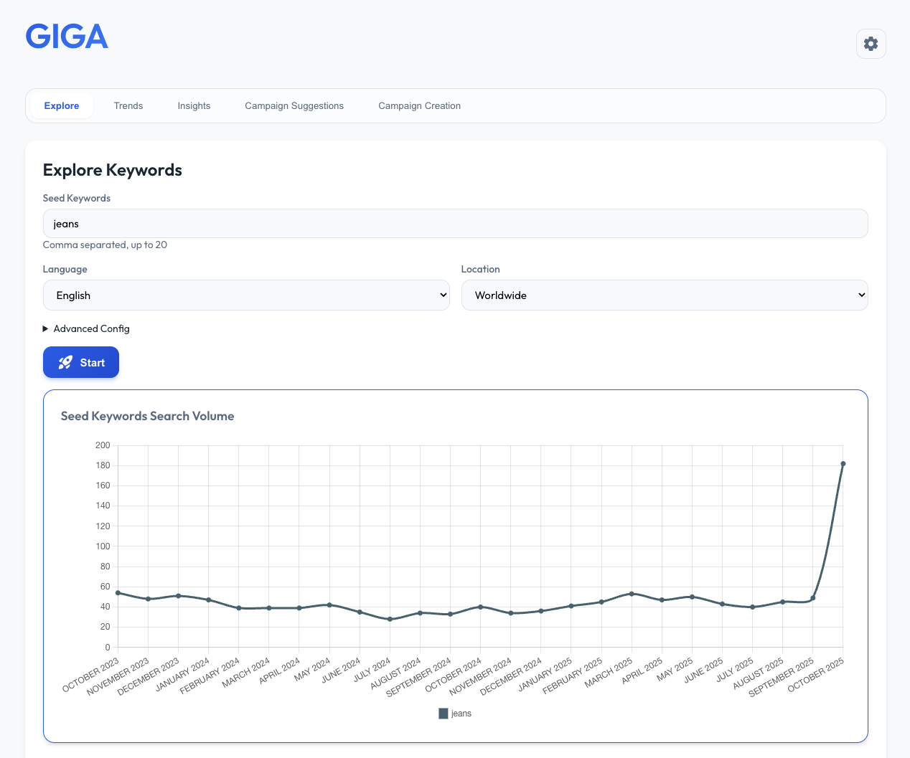
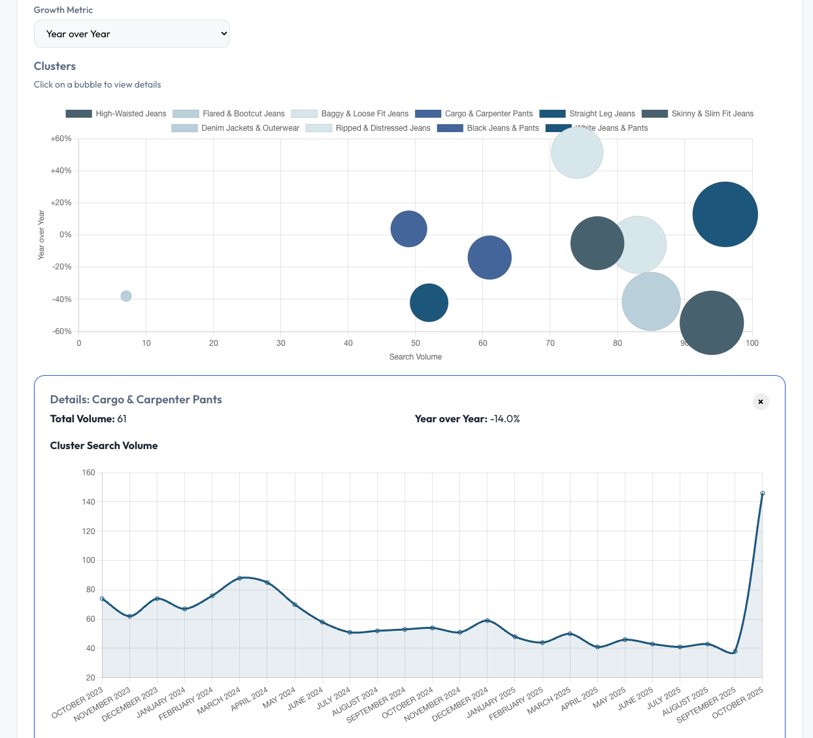
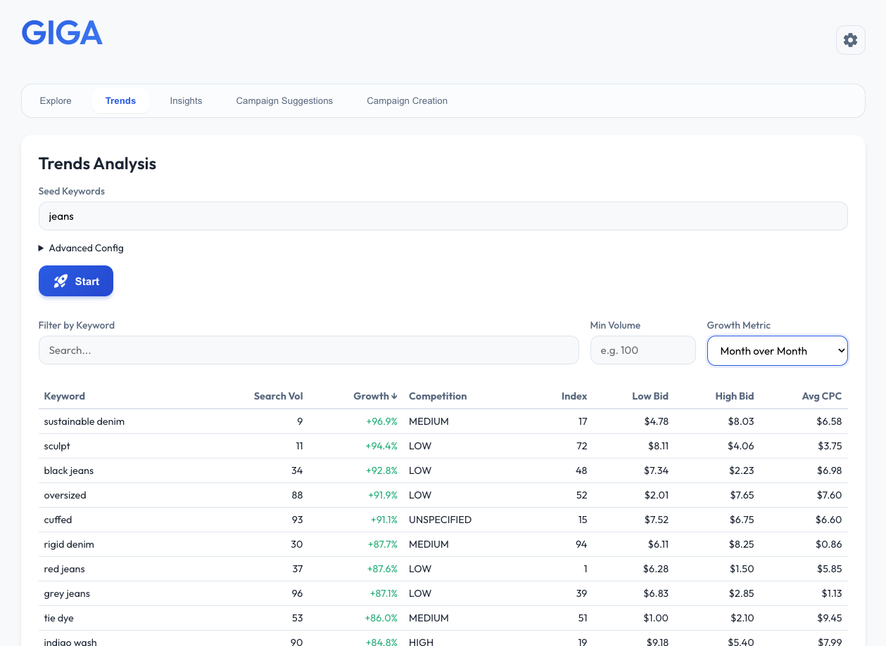

<!--
Copyright 2026 Google LLC

Licensed under the Apache License, Version 2.0 (the "License");
you may not use this file except in compliance with the License.
You may obtain a copy of the License at

      http://www.apache.org/licenses/LICENSE-2.0

Unless required by applicable law or agreed to in writing, software
distributed under the License is distributed on an "AS IS" BASIS,
WITHOUT WARRANTIES OR CONDITIONS OF ANY KIND, either express or implied.
See the License for the specific language governing permissions and
limitations under the License.
-->



# GIGA: Gemini Insights Generation Analysis

[](https://github.com/google-marketing-solutions/giga/commits)

**Disclaimer: This is not an official Google product.**

[Overview](#overview) •
[Challenge Addressed](#challenge-addressed) •
[Outcome & Impact](#outcome--impact) •
[Services Used](#services-used) •
[Limitations](#limitations) •
[Prerequisites](#prerequisites) •
[Get Started](#get-started) •

## Latest Updates

- **May 2026:** Initial version of GIGA on Google Cloud Run.
- **April 2026:** Account ID selector for Google Ads Manager accounts and added multi-select growth metrics.
- **March 2026:**
  - Agentic Insights Follow-up to power dynamic, ongoing chat analysis functionality.
  - Geographic features including support for location and language criterion lookups using Gemini.
  - [Copy Cat](https://github.com/google-marketing-solutions/copycat) format for campaign output generation.
- **February 2026:** Introduced user-specific property management to allow individual overrides of the Ads Account ID and Developer Token.
- **January 2026:** Added an option to specify the output language for generated insights.
- **December 2025:** Added performance metrics for campaign creation and introduced Dark Mode.
- **November 2025:** Added a direct "Export to Sheet" functionality for generated insights and keyword trends. Allowed customization of growth metrics (YoY, MoM, Last Month vs Average).

## Overview

GIGA is an AI-powered keyword intelligence and campaign generation tool. It
discovers trending search terms, clusters keywords semantically using Gemini,
and generates actionable insights and campaign recommendations to help advertisers
optimize their marketing strategies.

<p align="center">
  
</p>

_Please note: Search volume and other metrics are randomized for demonstration purposes._

## Challenge Addressed

Clients want to stay ahead of current search/keyword trends and capitalize on them quickly. Up-to-date insights into search trends are crucial for optimizing ad campaigns and driving sales in key product categories.

## Outcome & Impact

GIGA provides a clustering of all keyword ideas related to the input topic keywords. The solution also provides an insights summary page and recommendations for campaigns to create in order to capture current trending topics.

This provides clients with actionable, strategic insights for making marketing decisions and helps them create campaigns based on these insights.

Explore the search volume history of your seed keywords:

<p align="center">
  
</p>

Analyze generated clusters to identify trending topics:

<p align="center">
  
</p>

Inspect trending keywords:

<p align="center">
  
</p>

## Services Used

This project utilizes the following Google services:

- **[Vertex AI](https://cloud.google.com/vertex-ai/docs):** Used for generating intelligent insights and clustering keywords using Gemini models.
- **[Google Ads API (Keyword Planner)](https://developers.google.com/google-ads/api/docs/keyword-planning/generate-keyword-ideas):** Used for fetching keyword ideas, search volumes, and historical metrics.

## Limitations

- **[Keyword Idea Service](https://developers.google.com/google-ads/api/docs/keyword-planning/generate-keyword-ideas):** This service provides data based on full months. Consequently, data for the current month is not yet available; it becomes accessible only after the month has concluded. Additionally, there is a ≈10 days delay (e.g. on 10th March, data for complete February will be available).
- **[Keyword Volume](https://developers.google.com/google-ads/api/docs/keyword-planning/generate-keyword-ideas#historical_metrics):** Please note that keyword volume figures are rounded.

## Prerequisites

- **[Google Ads Account with a Developer Token](https://developers.google.com/google-ads/api/docs/access-levels):** The developer token needs **"Basic"** or **"Standard"** access level ("Test Account Access" is not sufficient). Additionally, it requires the **"Permissible Use"** for **"Researching keywords and recommendations"** (see [permissible use](https://developers.google.com/google-ads/api/docs/api-policy/access-levels#permissible-use) for details).
- Google Cloud Project with [Vertex AI](https://cloud.google.com/vertex-ai) enabled

## Get Started

To get started with GIGA, clone the repository and copy `configuration.env.template` to `configuration.env` and add all necessary information.

## Run locally

Run the server locally

```bash
sh bin/run_local.sh
```

Open [http://localhost:3000](http://localhost:3000) with your browser to see the result.

## Deploy

This deploys GIGA on Cloud Run and uses Identity Aware Proxy (IAP) for authentication so that only authenticated users can access the app.

```sh
sh bin/deploy.sh
```

After deployment is done, you'll see a link to the deployed app in the terminal output.
